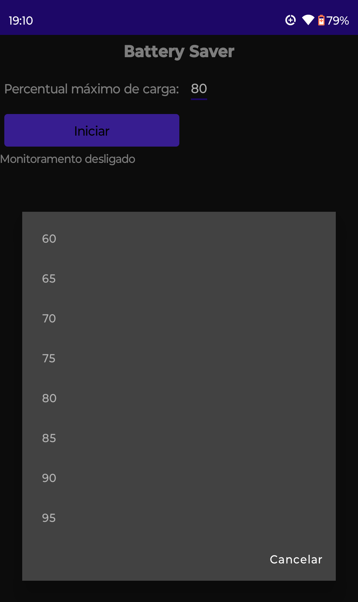
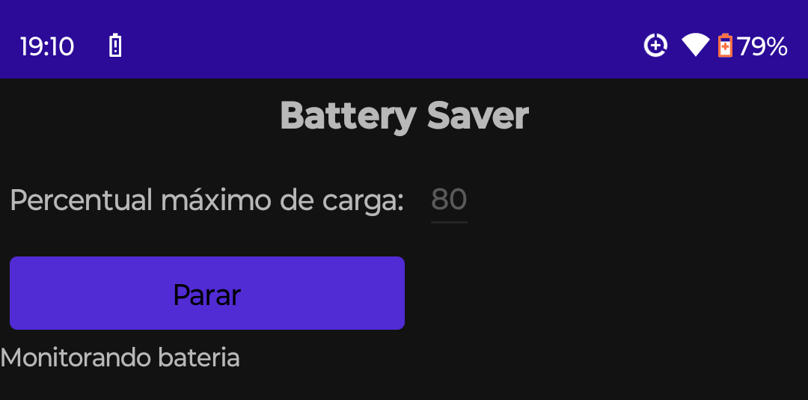

# Battery Saver

Simple application to avoid overcharging your cell phone battery. This is my first C# Maui project!

# How to use it

Open app, select maximum charge level (60% - 95%, recommended and default is 80%) and press "Start".

After that, you can close app. One notification will appear after a few seconds, indicating that Battery Saver is active.

When the battery level is equal or higher than selected level, Battery Saver will trigger your cell phone's alarm sound. To deactivate alarm, simply open application (clicking on its default icon or in notification at the top of the screen) and press "Stop".

# Current Limitations

1) Portuguese only;
2) Android Arm64 only and
3) Source code not available yet.

# Personal site:
http://www.nrbenergia.somee.com/  

or

https://nrbenergia.azurewebsites.net/

# More info:
https://www.linkedin.com/in/nelsonrossibittencourt/
