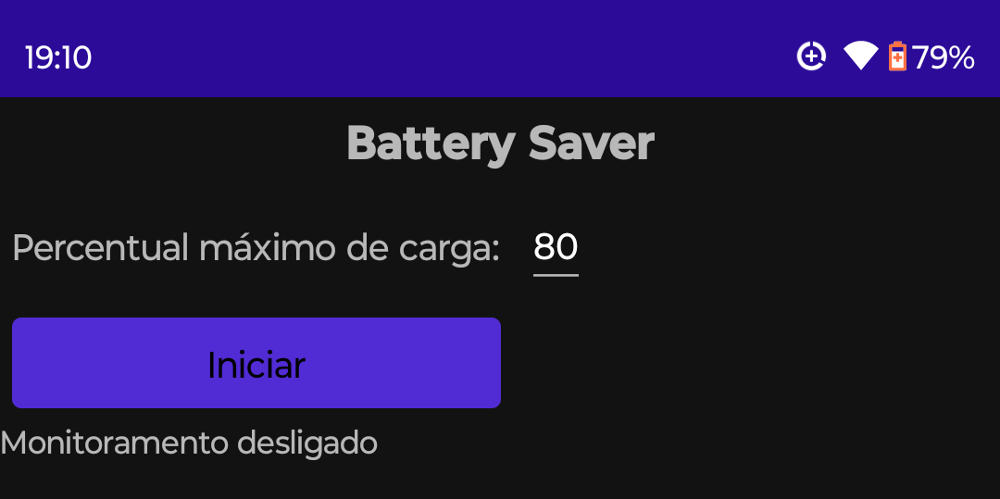

# Battery Saver

Simple application to avoid overcharging your cell phone battery.

# How to use it

Open app, select maximum charge level (60% - 95%, recommended and default is 80%) and press "Start".

After that, you can close the app. One notification will appear after a few seconds indicating that 
Battery Saver is active.

When the battery level is equal to or higher than the selected level, 
Battery Saver will sound your cell phone's alarm sound. To deactivate the alarm, simply open the application by clicking on its default icon or on the notification at the top of the screen.

# Personal site:
http://www.nrbenergia.somee.com/  

or

https://nrbenergia.azurewebsites.net/

# More info:
https://www.linkedin.com/in/nelsonrossibittencourt/
